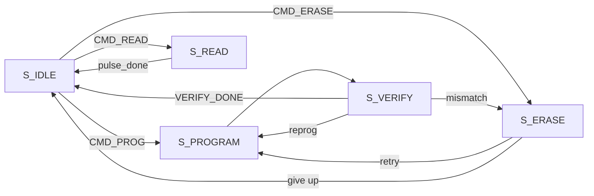
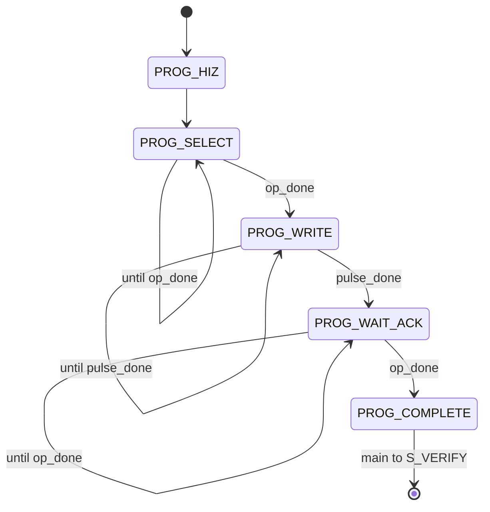
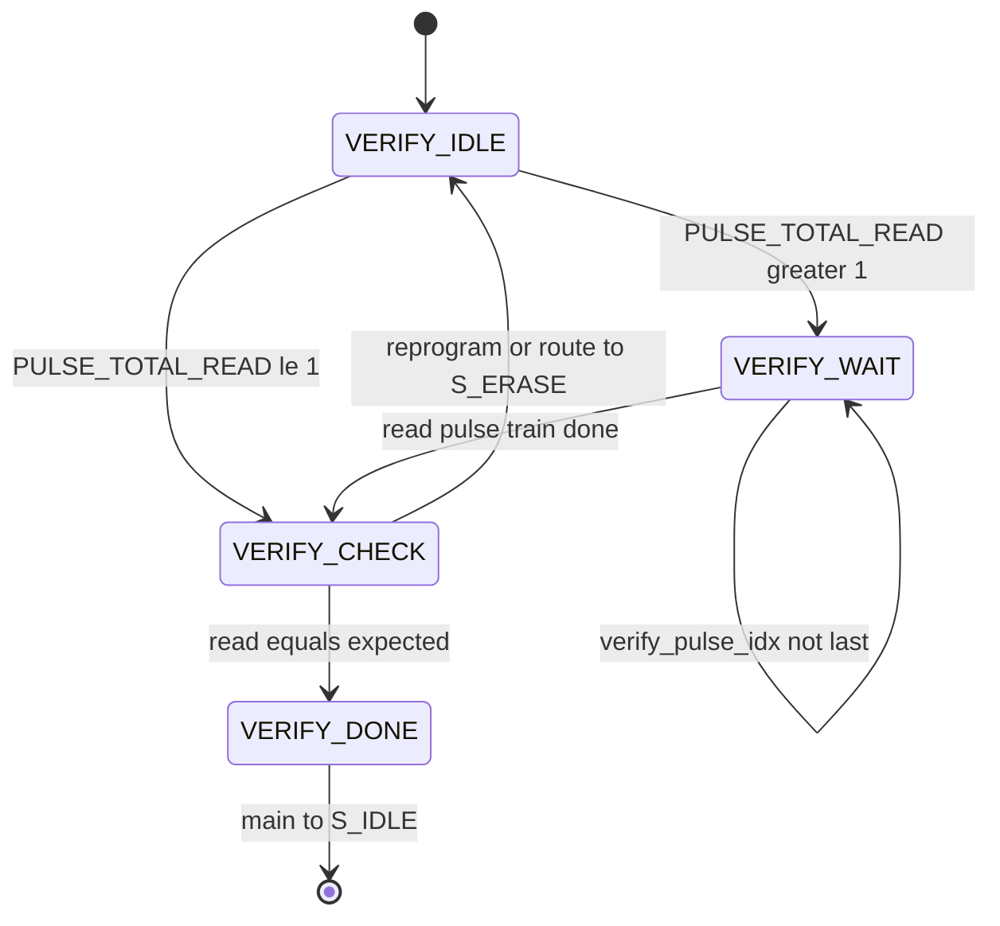
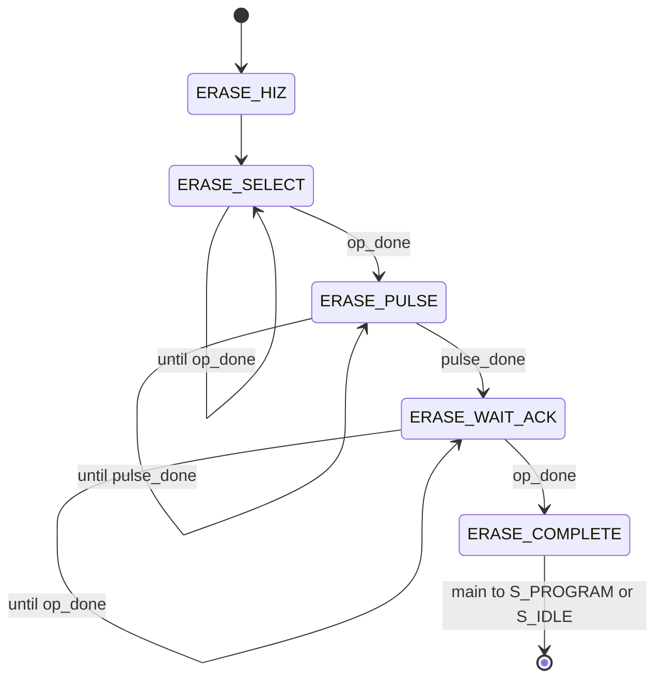

# Memristor-related controller FSMs

Block-level view of the FSMs that drive **`pulses`**, **`ann_core_word`**, and **`weight_read_data`** for memristor program / verify / erase / read. Matches [`source/Controller/controller.sv`](../../source/Controller/controller.sv) and [`controller_pkg::erase_state_t`](../../source/Controller/controller_pkg.sv) / [`prog_sequence_state_t`](../../source/Controller/controller_pkg.sv).

## Core handshake (`op_done`)

The ANN core (or testbench model) asserts **`op_done`** to acknowledge setup/teardown at these points:

| Location | Meaning |
|----------|---------|
| `PROG_SELECT` → `PROG_WRITE` | Core ready after buffer load / address setup |
| `PROG_WAIT_ACK` → `PROG_COMPLETE` | Core finished after program pulse train |
| `ERASE_SELECT` → `ERASE_PULSE` | Core ready before erase pulse train |
| `ERASE_WAIT_ACK` → `ERASE_COMPLETE` | Core finished after erase pulse train |

Pulse timing inside **`PROG_WRITE`** and **`ERASE_PULSE`** still uses internal **`pulse_done`** (burst-train length from `controller_pkg` and optional LUT).

## Main states touching the array

## Program sub-FSM (`S_PROGRAM` → memristor program)

- **`pulses`:** `010` (PROG) only in **`PROG_WRITE`** (per burst-train / LUT repeat rules); high-Z elsewhere in this sub-FSM.

## Verify sub-FSM (`S_VERIFY` → read cell, compare to expected)

- **`pulses`:** `001` (READ) in **`VERIFY_IDLE`** / **`VERIFY_WAIT`**; `000` in **`VERIFY_CHECK`** / **`VERIFY_DONE`** when sampling **`weight_read_data`**.

## Erase sub-FSM (`S_ERASE` → memristor erase)

- **`pulses`:** `011` (ERASE) only in **`ERASE_PULSE`**.

## Host read (`S_READ`)

Single-phase read: stay in **`S_READ`** until **`pulse_done`**, then return to **`S_IDLE`**. **`pulses`** follow the read burst train (`001` vs `000` gaps).

---

See also: [Controller operations diagram (full chip flow)](../meeting_prep/CONTROLLER_OPERATIONS_DIAGRAM.md).
