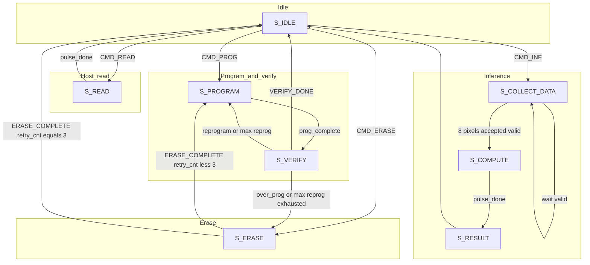
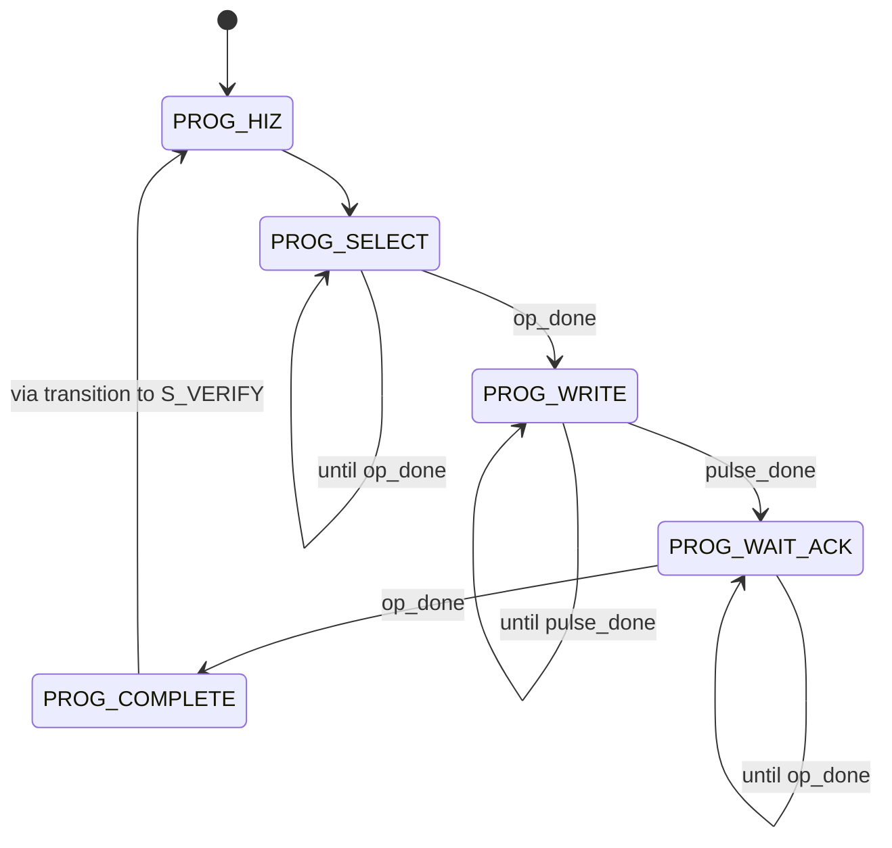
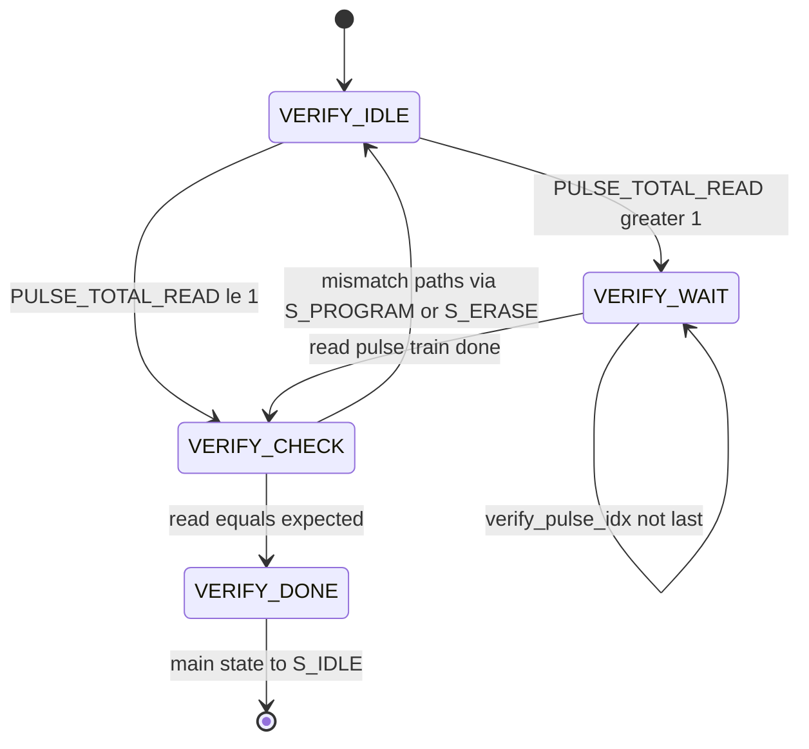
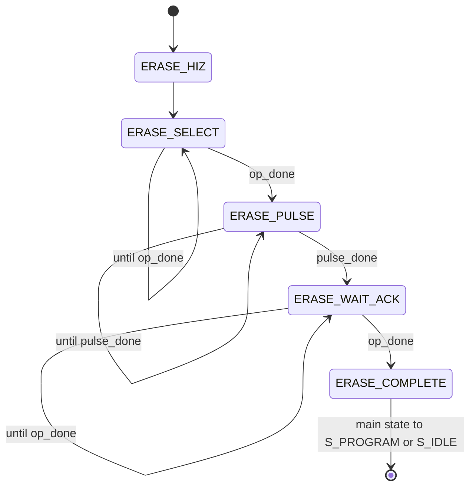

# Controller operations diagram

This document matches the main FSM and sub-FSMs in [`source/Controller/controller.sv`](../../source/Controller/controller.sv) as of the current RTL.

**Memristor-focused block diagrams** (program / verify / erase / read): [`../block_diagram/MEMRISTOR_FSMS.md`](../block_diagram/MEMRISTOR_FSMS.md).

## Command dispatch (from `S_IDLE`)

When `valid` is high:

| `cmd`       | Next main state   |
|------------|-------------------|
| `CMD_PROG` | `S_PROGRAM`       |
| `CMD_READ` | `S_READ`          |
| `CMD_ERASE`| `S_ERASE`         |
| `CMD_INF`  | `S_COLLECT_DATA`  |
| other      | stay `S_IDLE`     |

`CMD_HIZ` yields `valid == 0` at the parallel interface, so the controller never leaves `S_IDLE` for that “command.”

## Main state flow (high level)

Notes:

- **PROG→VERIFY** is unconditional after `PROG_COMPLETE` for the direct-address flow.
- **VERIFY** may loop to **PROGRAM** (under-programmed, within retry limit) or to **ERASE** (over-programmed, or reprog limit exceeded).
- **ERASE** returns to **PROGRAM** for another attempt while `retry_cnt < 3` after `ERASE_COMPLETE`; otherwise **IDLE** with error semantics in RTL.
- **COLLECT_DATA** stays in place until `valid`; the eighth pixel in a row triggers **COMPUTE** (combinational next_state when `data_count == 7` and `valid`).

## Programming sub-FSM (`S_PROGRAM` only)

After `PROG_COMPLETE`, the **main** state goes to `S_VERIFY` and `next_prog_state` resets to `PROG_HIZ` for a possible later program phase.

## Verify sub-FSM (`S_VERIFY`)

## Erase sub-FSM (`S_ERASE`)

## Pulse and `ann_core_word` summary

- **`ann_core_word`:** For non-idle states, `{data_byte_for_ann, one_hot_tail}` via `pack_ann_core_word` (see RTL). In `S_COLLECT_DATA`, the data byte comes from **live** `data`; in `S_PROGRAM`/`S_VERIFY`/`S_READ`/`S_ERASE`, from **registered** `data_reg`.
- **`pulses`:** PROG during `PROG_WRITE`; READ during `S_READ` and verify read/wait; ERASE during `ERASE_PULSE`; INF during `S_COMPUTE`. `op_done` from the core advances `PROG_SELECT`→`PROG_WRITE`, `PROG_WAIT_ACK`→`PROG_COMPLETE`, `ERASE_SELECT`→`ERASE_PULSE`, and `ERASE_WAIT_ACK`→`ERASE_COMPLETE`.

Parameter names and cycle counts: [`controller_pkg`](../../source/Controller/controller_pkg.sv) (`TREAD`, `TPROG`, `TERASE`, `TINF`, pulse totals, `MAX_PROG_RETRIES`).
