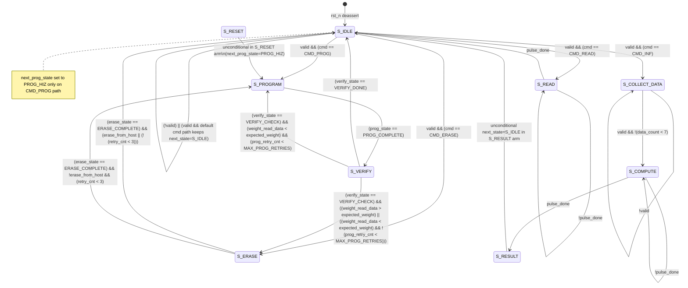
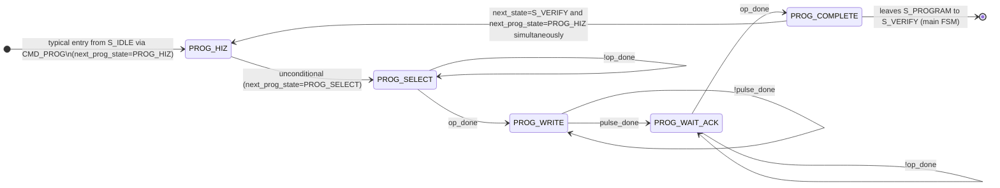
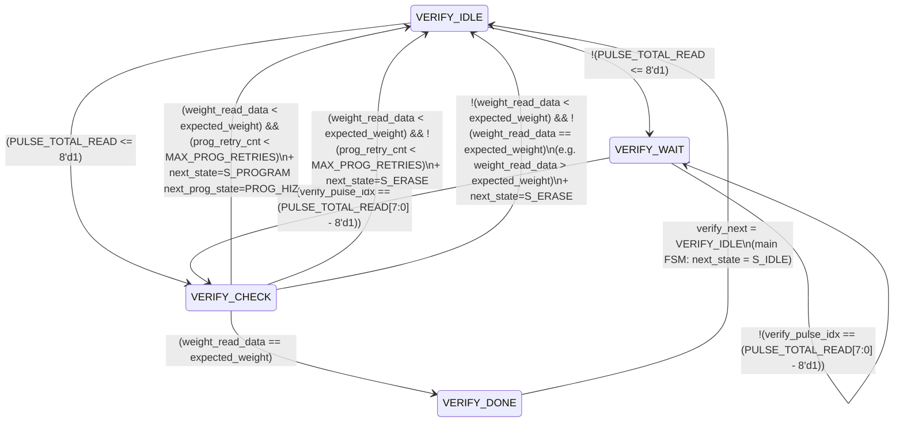
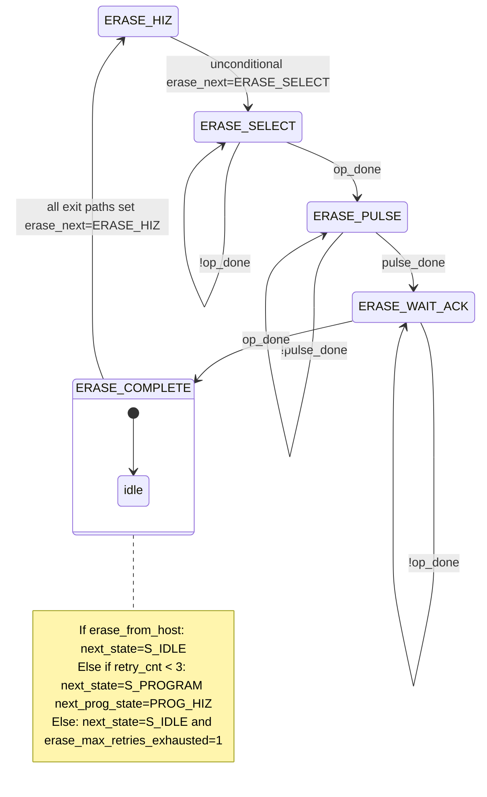

# Controller FSM and Control Logic

This chapter documents the **finite-state machines and control logic** implemented in `source/Controller/controller.sv` (module `ann_controller`; there is no separate `ann_controller.sv` filename in-tree). All transition conditions, output assignments, and handshake behavior are taken **only** from that file. Package constants and types are referenced from `controller_pkg.sv` (for example `MAX_PROG_RETRIES` and `PULSE_TOTAL_READ`, where `PULSE_TOTAL_READ` is the `pulse_train_total(TREAD, PULSE_NUM_READ, PULSE_GAP)` localparam).

**Implementation structure:** one combinational block (`` `comb(...)`` macro wrapping combinational logic) assigns **`next_state`**, **`next_prog_state`**, and per-branch outputs, with **`verify_next` / `erase_next` assigned only inside `S_VERIFY` / `S_ERASE`** (see §1). Two **`always_ff @(posedge clk or negedge rst_n)`** blocks register **`state`**, **`prog_state`**, counters, and capture **`address_reg` / `data_reg`**. A second **`always_ff`** registers **`verify_state` / `erase_state`** from **`verify_next` / `erase_next`**, **`retry_cnt`**, **`prog_retry_cnt`**, **`verify_pulse_idx`**, and **`program_stronger`**.

---

## 1) Shared defaults before `unique case (state)`

At the top of the combinational FSM block the RTL sets:

| Signal | Default |
|--------|---------|
| `ann_reset` | `1'b0` |
| `buf_reg_add` | `{{(6-BUF_ADDR_WIDTH){1'b0}}, buf_addr_reg}` (zero-extend `buf_addr_reg` to 6 bits) |
| `buf_reg_ctrl` | `CTRL_IDLE` |
| `buf_read_write` | `1'b0` (read) |
| `buf_bit_sel` | `bit_count` if `(state == S_COMPUTE)`, else `3'd0` |
| `busy` | `1'b0` |
| `next_state` | `state` |
| `next_prog_state` | `prog_state` |
| `verify_failure_starts_erase` | `1'b0` |
| `erase_max_retries_exhausted` | `1'b0` |

Individual `S_*` branches override these defaults.

**`verify_next` / `erase_next` coverage in `comb`:** The `unique case (state)` assigns **`verify_next` only inside `S_VERIFY`** and **`erase_next` only inside `S_ERASE`**. There is no explicit assignment to those variables in other main-state arms. In a fully elaborated `always_comb`, that pattern typically **infers transparent latches** (or tool-specific “hold previous”) on `verify_next` / `erase_next` when `state` is not the owning state. The second `always_ff` still does **`verify_state <= verify_next`** and **`erase_state <= erase_next` every cycle**, so the registered sub-states always sample whatever combinational value resolves (including any inferred storage).

---

## 2) Main FSM state-by-state (combinational next-state and outputs)

### 2.1 `S_IDLE`

**Outputs while in this state (branch body):**

- `busy = 1'b0`
- `buf_reg_add = '0`
- `buf_reg_ctrl = CTRL_IDLE`
- `buf_read_write = 1'b0`

**Transitions:**

- If **`!valid`**: `next_state = S_IDLE` (stays idle).
- If **`valid`**: `unique case (cmd)`:
  - `CMD_PROG` → `next_state = S_PROGRAM`, **`next_prog_state = PROG_HIZ`**
  - `CMD_ERASE` → `next_state = S_ERASE`
  - `CMD_READ` → `next_state = S_READ`
  - `CMD_INF` → `next_state = S_COLLECT_DATA`
  - `default` → `next_state = S_IDLE`

There is **no** assignment to `next_prog_state` in the `CMD_ERASE` / `CMD_READ` / `CMD_INF` arms in this `if (valid)` branch; **`next_prog_state` retains the default** `next_prog_state = prog_state` for those arms.

**Registered capture (sequential, not in `` `comb``):** On **`posedge clk`**, if **`valid && (state == S_IDLE)`**, the design registers **`address_reg <= address`** and **`data_reg <= data`**. Thus the combinational transition to `S_PROGRAM` / `S_READ` / etc. uses **`address_reg`/`data_reg` only after the clock edge that leaves idle**, i.e. first cycle in the new state sees the captured address/data.

---

### 2.2 `S_RESET`

**Outputs:**

- `busy = 1'b1`
- `ann_reset = 1'b1`
- `buf_reg_ctrl = CTRL_IDLE`
- `buf_read_write = 1'b0`

**Transitions (unconditional in this branch):**

- `next_state = S_PROGRAM`
- `next_prog_state = PROG_HIZ`

**RTL note:** No `S_IDLE` branch sets **`next_state = S_RESET`**. The only legal entry is **power/reset** loading **`S_IDLE`**, or **`default`** in the main `unique case (state)` forcing **`S_IDLE`** — neither enters **`S_RESET`**. The sequential block still contains legacy init for **`state == S_IDLE && next_state == S_RESET`** (weight/matrix defaults and **`buffer_idx_reg <= '0`**), but with the published combinational FSM, **`next_state` is never `S_RESET`**, so **those `next_state == S_RESET` arms are unreachable** unless additional RTL (not in this file) drives **`next_state`** elsewhere. **`S_RESET` self-loops are absent:** one cycle in **`S_RESET`** always advances to **`S_PROGRAM`**.

---

### 2.3 `S_PROGRAM`

**Outputs:**

- `busy = 1'b1`

**Buffer interface (multiplexed by `prog_state`):**

- If **`(prog_state == PROG_HIZ) || (prog_state == PROG_SELECT)`**:
  - `buf_reg_add = address_reg[5:0]`
  - `buf_reg_ctrl = CTRL_DATA_LOAD`
  - `buf_read_write = 1'b1` (write to buffer)
- **Else** (includes **`PROG_WRITE`**, **`PROG_WAIT_ACK`**, **`PROG_COMPLETE`**, and **`default`**):
  - `buf_reg_add = address_reg[5:0]`
  - `buf_reg_ctrl = CTRL_WEIGHT_READ`
  - `buf_read_write = 1'b0` (read)

**Inner `unique case (prog_state)` — `next_prog_state` / `next_state`:**

| `prog_state` | Next-state rule |
|--------------|-----------------|
| `PROG_HIZ` | `next_prog_state = PROG_SELECT` |
| `PROG_SELECT` | `next_prog_state = op_done ? PROG_WRITE : PROG_SELECT` |
| `PROG_WRITE` | `next_prog_state = pulse_done ? PROG_WAIT_ACK : PROG_WRITE` |
| `PROG_WAIT_ACK` | `next_prog_state = op_done ? PROG_COMPLETE : PROG_WAIT_ACK` |
| `PROG_COMPLETE` | `next_state = S_VERIFY`, `next_prog_state = PROG_HIZ` |
| `default` | `next_prog_state = PROG_HIZ` |

**`op_done` usage:** purely **combinational** gating: while **`prog_state == PROG_SELECT`**, **`next_prog_state`** becomes **`PROG_WRITE`** iff **`op_done`** is 1 in the same evaluation; while **`PROG_WAIT_ACK`**, **`PROG_COMPLETE`** requires **`op_done`**. There is **no `always_ff` sampling** of **`op_done`** inside `ann_controller`.

**Pulse activity:** **`pulses`** are driven as **`PULSE_MODE_PROG`** only when **`(state == S_PROGRAM) && (prog_state == PROG_WRITE)`** and the corresponding train-active Boolean is true (see §5). **`pulse_cnt`** increments only while **`prog_state == PROG_WRITE`**, **`next_prog_state == PROG_WRITE`**, and **`!pulse_done`** (sequential block).

---

### 2.4 `S_VERIFY`

**Outputs:**

- `busy = 1'b1`
- `buf_reg_add = address_reg[5:0]`
- `buf_reg_ctrl = CTRL_WEIGHT_READ`
- `buf_read_write = 1'b0`
- `weight_read_en = (verify_state == VERIFY_IDLE) ? 1'b1 : 1'b0` — *no other statement in this file reads `weight_read_en`*

**Inner `unique case (verify_state)`** sets **`verify_next`** and sometimes **`next_state`** / **`next_prog_state`**:

#### `VERIFY_IDLE`

- If **`PULSE_TOTAL_READ <= 8'd1`**: **`verify_next = VERIFY_CHECK`**
- Else: **`verify_next = VERIFY_WAIT`**

#### `VERIFY_WAIT`

- If **`verify_pulse_idx == (PULSE_TOTAL_READ[7:0] - 8'd1)`**: **`verify_next = VERIFY_CHECK`**
- Else: **`verify_next = VERIFY_WAIT`**

#### `VERIFY_CHECK` (detailed in §4)

#### `VERIFY_DONE`

- **`next_state = S_IDLE`**
- **`verify_next = VERIFY_IDLE`**

#### `default`

- **`verify_next = VERIFY_IDLE`**

**Pulse activity:** For **`verify_state == VERIFY_IDLE`** or **`VERIFY_WAIT`**, **`pulses`** toggles **`PULSE_MODE_READ`** vs **`PULSE_MODE_HIZ`** using **`pulse_train_active`**.

---

### 2.5 `S_ERASE`

**Outputs:**

- `busy = 1'b1`
- `buf_reg_ctrl = CTRL_IDLE`
- `buf_read_write = 1'b0`
- `buf_reg_add` uses default (**`buf_addr_reg`**, not overridden in this branch)

**Inner `unique case (erase_state)`:**

| `erase_state` | Rule for `erase_next` |
|---------------|----------------------|
| `ERASE_HIZ` | `erase_next = ERASE_SELECT` |
| `ERASE_SELECT` | `erase_next = op_done ? ERASE_PULSE : ERASE_SELECT` |
| `ERASE_PULSE` | `erase_next = pulse_done ? ERASE_WAIT_ACK : ERASE_PULSE` |
| `ERASE_WAIT_ACK` | `erase_next = op_done ? ERASE_COMPLETE : ERASE_WAIT_ACK` |
| `ERASE_COMPLETE` | See §3.3 |
| `default` | `erase_next = ERASE_HIZ` |

---

### 2.6 `S_READ`

**Outputs:**

- `busy = 1'b1`
- `buf_reg_ctrl = CTRL_IDLE`
- `buf_read_write = 1'b0`
- Default **`buf_reg_add`** (from **`buf_addr_reg`**) applies unless overridden elsewhere; this branch does not set **`buf_reg_add`**.

**Transitions:**

- If **`pulse_done`**: `next_state = S_IDLE`
- Else: `next_state = S_READ`

**Pulses:** **`PULSE_MODE_READ`** when **`pulse_train_active`** true for **`S_READ`**.

---

### 2.7 `S_COLLECT_DATA`

**Outputs:**

- `busy = 1'b1`
- `buf_reg_add = (row_count * 8) + data_count`
- `buf_reg_ctrl = CTRL_DATA_LOAD`
- `buf_read_write = 1'b1`

**Transitions:**

- If **`valid`**:
  - If **`data_count < 7`**: `next_state = S_COLLECT_DATA`
  - Else (`data_count == 7` on this qualified branch): `next_state = S_COMPUTE`
- If **`!valid`**: `next_state = S_COLLECT_DATA`

**Sequential behavior (separate `always_ff`):** When **`state == S_COLLECT_DATA`**, on **`valid`**, **`data_count`**, **`row_count`**, and **`buf_write_addr`** update; **`buf_write_addr <= (row_count * 8) + data_count`** uses the **registered** counter values as written in the sequential block.

---

### 2.8 `S_COMPUTE`

**Outputs:**

- `busy = 1'b1`
- `buf_reg_add = '0`
- `buf_reg_ctrl = CTRL_COMPUTE`
- `buf_read_write = 1'b0`
- **`buf_bit_sel`**: also forced to **`bit_count`** via default `(state == S_COMPUTE) ? bit_count : 0` at top of block

**Transitions:**

- If **`pulse_done`**: `next_state = S_RESULT`
- Else: `next_state = S_COMPUTE`

**Sequential:** **`bit_count`** advances each cycle in **`S_COMPUTE`**; reset when leaving **`S_COMPUTE`** (conditions in `always_ff`).

---

### 2.9 `S_RESULT`

**Outputs:**

- `busy = 1'b1`
- `buf_reg_ctrl = CTRL_RESULT_OUT`
- `buf_read_write = 1'b0`

**Transitions:**

- **`next_state = S_IDLE`** (unconditional in this branch; comment says result completes immediately)

---

### 2.10 `default` (illegal / unknown `state`)

- `next_state = S_IDLE`
- `next_prog_state = PROG_HIZ`

---

## 3) Sub-FSMs — hardware manual view

### 3.1 Program sub-FSM (`prog_state` / `next_prog_state`)

**Reset:** `prog_state <= PROG_HIZ` on **`!rst_n`**.

**Flow (must pass through PROG_SELECT after PROG_HIZ):**

1. **`PROG_HIZ` → `PROG_SELECT`** (one combinational step).
2. **`PROG_SELECT`**: stalls until **`op_done`**; **`next_prog_state = PROG_WRITE`** iff **`op_done`** else stays **`PROG_SELECT`**.
3. **`PROG_WRITE`**: holds until **`pulse_done`** ( **`pulse_cnt`** vs **`pulse_total`** for PROG LUT or fixed train); then **`PROG_WAIT_ACK`**.
4. **`PROG_WAIT_ACK`**: stalls until **`op_done`**; then **`PROG_COMPLETE`**.
5. **`PROG_COMPLETE`**: **`next_state = S_VERIFY`**, **`next_prog_state = PROG_HIZ`**.

**Handshake summary:** **`op_done`** is a **level-sensitive combinational condition** for advancing out of **`PROG_SELECT`** and **`PROG_WAIT_ACK`**. The registered **`prog_state`** updates on the next clock edge to the resolved **`next_prog_state`**.

---

### 3.2 Verify sub-FSM (`verify_state` / `verify_next`)

**Reset:** `verify_state <= VERIFY_IDLE`.

**Index for read train:** **`verify_pulse_idx`** (registered):

- If **`state != S_VERIFY`**: **`verify_pulse_idx <= 8'd0`**
- Else if **`verify_state == VERIFY_IDLE`**: **`verify_pulse_idx <= 8'd1`**
- Else if **`verify_state == VERIFY_WAIT && verify_next == VERIFY_WAIT`**: **`verify_pulse_idx <= verify_pulse_idx + 1`**

So in **`VERIFY_WAIT`**, the index increments only when the combinational logic chooses to stay in **`VERIFY_WAIT`**.

**`PULSE_TOTAL_READ` (package):** From `TREAD`, `PULSE_NUM_READ`, `PULSE_GAP` via **`pulse_train_total`**. With default constants in **`controller_pkg`**, **`PULSE_TOTAL_READ` is 2**, so **`PULSE_TOTAL_READ <= 8'd1`** is **false** — the RTL takes **`VERIFY_IDLE` → `VERIFY_WAIT`**, not directly to **`VERIFY_CHECK`**.

---

### 3.3 Erase sub-FSM (`erase_state` / `erase_next`)

**Flow:** **`ERASE_HIZ` → ERASE_SELECT → ERASE_PULSE → ERASE_WAIT_ACK → ERASE_COMPLETE`**.

- **`ERASE_SELECT`**: **`op_done`** must be true to enter **`ERASE_PULSE`**.
- **`ERASE_PULSE`**: **`pulse_done`** required to enter **`ERASE_WAIT_ACK`**.
- **`ERASE_WAIT_ACK`**: **`op_done`** required to enter **`ERASE_COMPLETE`**.

**`ERASE_COMPLETE` decision (combinational):**

| Condition | `next_state` | `next_prog_state` | `erase_next` |
|-----------|--------------|-------------------|--------------|
| `erase_from_host` | `S_IDLE` | `PROG_HIZ` | `ERASE_HIZ` |
| `!erase_from_host && (retry_cnt < 3)` | `S_PROGRAM` | `PROG_HIZ` | `ERASE_HIZ` |
| Else (`!erase_from_host && !(retry_cnt < 3)`) | `S_IDLE` | `PROG_HIZ` | `ERASE_HIZ`; **`erase_max_retries_exhausted = 1'b1`** |

**`erase_from_host` register (sequential, first `always_ff` block):** Priority `if / else if` chain:

- Cleared **`1'b0`** when **`(state == S_VERIFY) && (next_state == S_ERASE)`** (verify-driven erase path).
- Set **`1'b1`** when **`(state == S_IDLE) && valid && (cmd == CMD_ERASE)`** (host erase command sampled with registered `state` / inputs on the clock edge behavior defined by the simulator).
- Cleared **`1'b0`** when **`(state == S_ERASE) && (next_state == S_IDLE)`** (erase sequence finished back to idle).

---

## 4) `VERIFY_CHECK` — compare, retries, and main-state branch

### 4.1 Combinational compares

`expected_weight` is **`assign expected_weight = weight_from_buffer;`**. In the buffer/weight region wrapped by the `` `comb(...)`` macro near the middle of `ann_controller`, when **`state == S_PROGRAM` or `state == S_VERIFY`**, **`weight_from_buffer = buf_data[3:0]`** (the lower nibble of the buffer read port). **`buf_addr_reg`** for those main states is **`address_reg[5:0]`**, so the expected nibble is the buffer contents at the programmed cell address.

In **`VERIFY_CHECK`**, the **`unique case`** body is equivalent to:

1. **`weight_read_data == expected_weight`**  
   - **`verify_next = VERIFY_DONE`**

2. **`weight_read_data < expected_weight`** (under-programmed)  
   - If **`prog_retry_cnt < MAX_PROG_RETRIES`** (`controller_pkg::MAX_PROG_RETRIES` is **3**):  
     - **`next_state = S_PROGRAM`**, **`next_prog_state = PROG_HIZ`**
   - Else:  
     - **`verify_failure_starts_erase = 1'b1`**, **`next_state = S_ERASE`**
   - In both under-programmed subcases: **`verify_next = VERIFY_IDLE`**

3. **Else** (`weight_read_data > expected_weight` — over-programmed):  
   - **`verify_failure_starts_erase = 1'b1`**, **`next_state = S_ERASE`**, **`verify_next = VERIFY_IDLE`**

### 4.2 Sequential `prog_retry_cnt` and `retry_cnt` (clocked)

In **`always_ff`** (second block), priority **if / else if** chain:

1. If **`state == S_VERIFY && verify_state == VERIFY_DONE`**:  
   **`retry_cnt <= 0`**, **`prog_retry_cnt <= 0`**, **`program_stronger <= 0`**

2. Else if **`state == S_VERIFY && verify_state == VERIFY_CHECK && weight_read_data < expected_weight && prog_retry_cnt < MAX_PROG_RETRIES`**:  
   **`prog_retry_cnt <= prog_retry_cnt + 1`**

3. Else if **`state == S_VERIFY && verify_state == VERIFY_CHECK && (weight_read_data > expected_weight || prog_retry_cnt >= MAX_PROG_RETRIES)`**:  
   **`prog_retry_cnt <= 0`**

4. Else if **`state == S_ERASE && erase_state == ERASE_COMPLETE`**:  
   **`retry_cnt <= retry_cnt + 1`**, **`prog_retry_cnt <= 0`**

5. Else if **`state == S_PROGRAM && prog_state == PROG_COMPLETE && buffer_idx_reg < (weight_count_reg - 1)`**:  
   **`retry_cnt <= 0`**, **`program_stronger <= 0`**

**`program_stronger`:** If **`state == S_VERIFY && verify_state == VERIFY_CHECK`** and **`weight_read_data != expected_weight && expected_weight > weight_read_data`**, then **`program_stronger <= 1'b1`** (non-blocking in a separate `if` in the same `always_ff`).

**Interpretation:** **`VERIFY_CHECK`** compares **`weight_read_data`** (4-bit ADC path from the core) to **`expected_weight`** (buffer nibble). The **re-prog branch** tests **`prog_retry_cnt < MAX_PROG_RETRIES`** with **`MAX_PROG_RETRIES = 3`**. On each **posedge** where **`state == S_VERIFY`**, **`verify_state == VERIFY_CHECK`**, **`weight_read_data < expected_weight`**, and **`prog_retry_cnt < MAX_PROG_RETRIES`**, **`prog_retry_cnt`** increments. When **`prog_retry_cnt`** reaches **`3`**, the strict inequality **`prog_retry_cnt < MAX_PROG_RETRIES`** is false, so the combinational tree selects **`next_state = S_ERASE`** (and sets **`verify_failure_starts_erase`**) instead of **`next_state = S_PROGRAM`**.

The **`if (state == S_VERIFY && verify_state == VERIFY_CHECK && ... prog_retry_cnt >= MAX_PROG_RETRIES)`** branch resets **`prog_retry_cnt`** to **0** on the same class of verify failures that lead toward erase (over-programmed, or under-programmed with exhausted re-prog budget), aligning the counter before **`S_ERASE`**.

---

## 5) Pulse duration / decode (ties to FSM)

**`pulse_total`** is computed in combinational logic when:

- **`state == S_READ`** → **`PULSE_TOTAL_READ`**
- **`state == S_PROGRAM && prog_state == PROG_WRITE`** → LUT / retry / macro repeat branches
- **`state == S_ERASE && erase_state == ERASE_PULSE`** → **`PULSE_TOTAL_ERASE`**
- **`state == S_COMPUTE`** → **`PULSE_TOTAL_INF`**

**`pulse_done = (pulse_total > 0) && (pulse_cnt >= pulse_total - 1)`.**

**`pulse_cnt` reset** when entering **`S_READ`**, entering **`PROG_WRITE`**, entering **`ERASE_PULSE`**, or entering **`S_COMPUTE`** (edge conditions in **`always_ff`** matching **`next_state`** / **`next_prog_state`** / **`erase_next`**).

---

## 6) Mermaid diagrams (raw; arrow labels = RTL conditions from `ann_controller.sv`)

### 6.1 Main FSM (high-detail)

### 6.2 Program sub-FSM (inside `S_PROGRAM`)

### 6.3 Verify sub-FSM (inside `S_VERIFY`)

### 6.4 Erase sub-FSM (inside `S_ERASE`)

---

## 7) Signals assigned but not consumed in this file

- **`verify_failure_starts_erase`**: assigned in **`VERIFY_CHECK`** branches; **no read** in `ann_controller.sv`.
- **`erase_max_retries_exhausted`**: assigned when erase-complete exit takes the **`else`** branch (**`!erase_from_host && !(retry_cnt < 3)`**); **no read** in `ann_controller.sv`.
- **`weight_read_en`**: assigned in **`S_VERIFY`**; **no read** in `ann_controller.sv`.

These may exist for hierarchical **testbench access** or **future glue**; they are not part of internal feedback paths in the cited module body.
